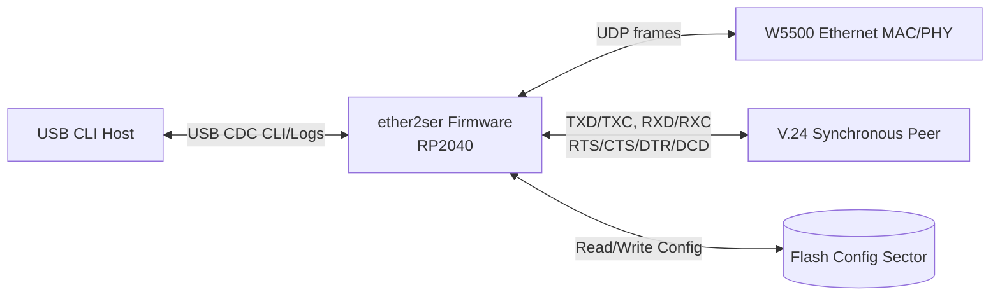
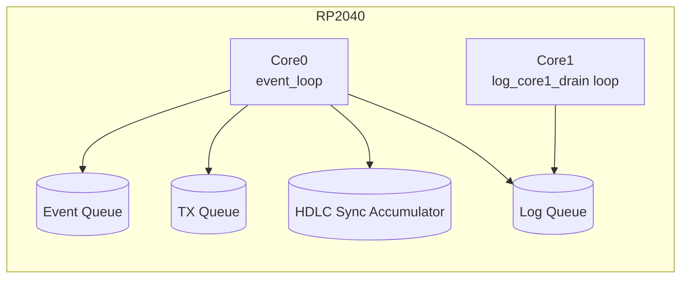
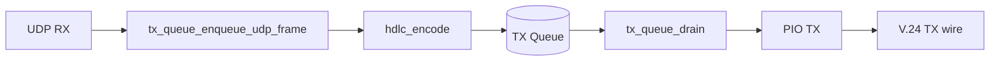
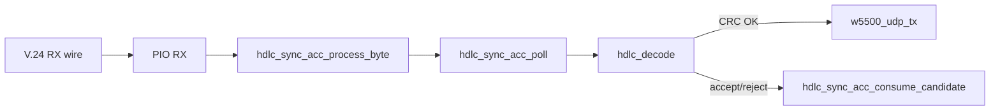
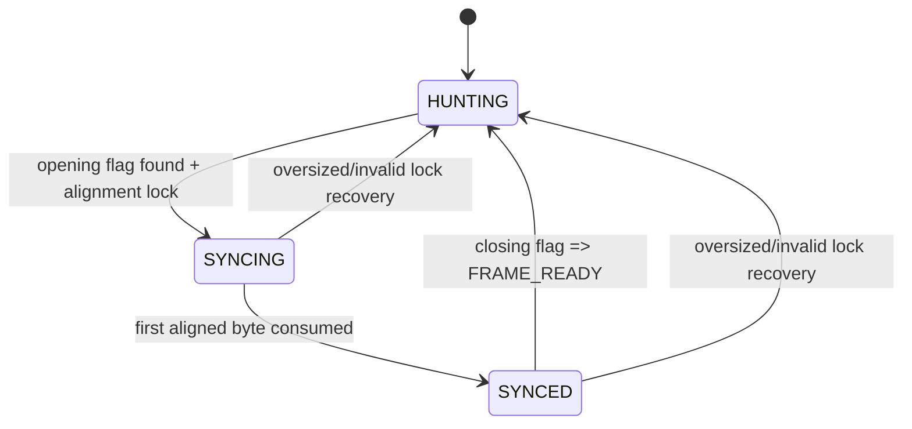
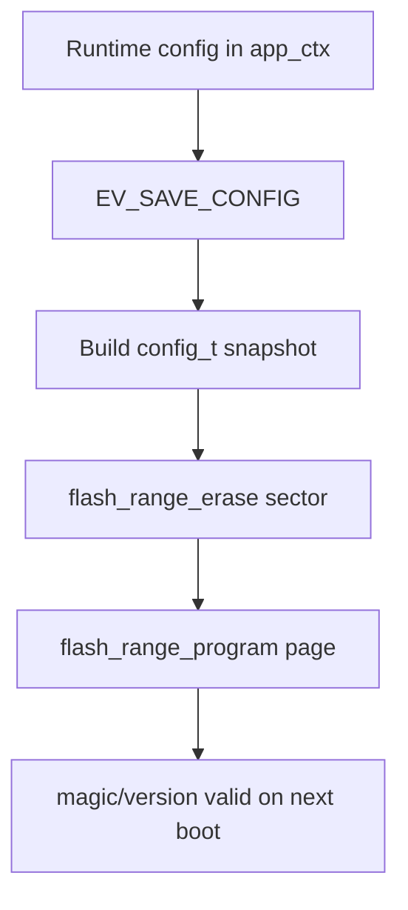

# Software Design and Architecture Description (SDD/SAD)

## 1. Purpose
This document describes the software design and architecture of `ether2ser` as currently implemented in `src/`.

Scope:
- Runtime architecture and module decomposition
- Data and control flows (UDP, HDLC, synchronous V.24)
- Concurrency model and scheduling behavior
- Configuration, persistence, CLI, logging, diagnostics
- Build and test structure

## 2. System Context
`ether2ser` runs on **W55RP20-EVB-PICO** (RP2040 + integrated W5500) and bridges:
- Ethernet UDP datagrams
- Synchronous V.24 serial stream (HDLC framed)

Functional behavior:
- UDP payload -> HDLC bit-stuffed frame -> serial TX
- Serial RX stream -> HDLC sync/deframe/CRC -> UDP payload TX
- USB CDC CLI for runtime control and diagnostics
- Flash-backed persistent configuration

## 3. Architectural Style
The firmware uses a **polling control loop** on core0 plus a **dedicated logging drain loop** on core1.

Design decisions:
- Deterministic polling control flow (no RTOS)
- Static allocation for runtime data paths
- Bounded queues and bounded protocol accumulators
- Event queue for control-plane actions (CLI/config/status)
- Asynchronous logging via lock-free single-producer/single-consumer queue

Concurrency model:
- **Core0**: network/serial data plane + CLI + event dispatch + watchdog feed
- **Core1**: drains log queue to stdout and flushes

### 3.1 High-Level Context Diagram

## 4. Runtime Architecture
### 4.1 Startup Path (`src/main.c`)
Startup sequence:
1. Initialize stdio/USB (`stdio_init_all`) and delay for host enumeration.
2. Initialize W5500 driver (`w5500_driver_init`) and board pin directions (`init_pins`).
3. Validate/read persistent config (`config_is_valid`, `config_read`).
4. Initialize app context (`init_app`).
5. Open local UDP socket (`w5500_open_udp_socket`).
6. Initialize TX queue (`tx_queue_init`).
7. Initialize PIO TX (`tx_clock_init`) and RX (`rx_clock_init`) state machines.
8. Initialize baudrate estimator for RX clock and optionally TX external clock.
9. Enable watchdog.
10. Print banner/version; optionally dump config in debug log level.
11. Launch core1 log drain loop (`multicore_launch_core1`).
12. Initialize event queue (`event_queue_init`).
13. Assert DTR and enter `event_loop(app)`.

### 4.2 Main Loop (`src/system/event_loop.c`)
Each iteration:
1. Feed watchdog.
2. Poll CLI input (`cli_poll`) and enqueue CLI line events.
3. Early RX drain from PIO FIFO into HDLC sync accumulator.
4. Sample W5500 UDP socket pressure counters (`w5500_poll_udp_buffer_full_events`).
5. Poll TX queue stats and drain up to `TX_QUEUE_DRAIN_CHUNK_SIZE` bytes to PIO TX.
6. If queue empty, run TX completion/RTS holdoff logic (`tx_poll`).
7. Update UDP RX throttle state from TX queue occupancy (`TX_QUEUE_HIGH_WM` / `TX_QUEUE_LOW_WM`).
8. Poll UDP RX (`w5500_poll_rx`) and enqueue encoded frames into TX queue only when not throttled.
9. Second RX drain pass.
10. Apply HDLC idle-timeout resync policy.
11. Poll HDLC sync for ready frames; decode and forward UDP immediately.
12. Apply HDLC no-progress resync policy.
13. Update runtime stats snapshots (decode stats, queue HWM/drops, log drops/HWM).
14. Poll RX FIFO stall flags.
15. Dispatch control events (up to 20 per loop, or 2 while TX active).
16. Redraw CLI prompt if output happened.
17. Sleep `50 us` when no work was done.

Implementation notes:
- TX work bookkeeping now uses actual drain progress (`bytes_drained > 0`) instead of only error code.
- UDP RX throttling is hysteretic and increments dedicated stats (`udp_rx_throttle_enter`, `udp_rx_throttle_skips`).

### 4.3 Runtime Concurrency Diagram

HDLC resync/recovery policies in loop:
- Idle timeout (`HDLC_SYNC_IDLE_TIMEOUT_US`)
- Decode fail streak hard resync (`HDLC_DECODE_FAIL_STREAK_LIMIT`)
- No-progress byte-window resync with different thresholds for internal/external clock
  (`2048` internal, `12288` external), active only after first successful decode lock
- External-clock hunting idle-byte suppression for long runs of `0x00/0xFF`
  (first two bytes kept, subsequent run bytes dropped while in `HUNTING`)

## 5. Module Decomposition
### 5.1 Application Context (`src/system/app_context.h`)
`app_ctx_t` is the central shared state:
- Effective runtime configs (`local`, `destination`, `sender`, `net`, `v24`)
- Persistent config snapshot
- UDP RX/TX frame buffers
- HDLC reconstructed frame + sync accumulator
- TX queue + backing storage
- Runtime statistics (`payload_statistics_t`)
- CLI prompt state

### 5.2 Control Plane Modules
- `system/event_queue.*`: bounded event transport
- `system/event_dispatch.*`: event handlers for status/config/CLI actions
- `system/cli_usb_cdc.*`: USB CDC line input and event emission
- `system/cli_commands.*`: command routing and event creation
- `system/cli_parser.*`: strict argument parsing and pin lookup
- `platform/watchdog.*`: reboot abstraction

### 5.3 Data Plane Modules
- `drivers/w5500_driver.*`: UDP RX/TX and socket/network control
- `protocol/hdlc_encoder.*`: bit-stuffed HDLC encoding
- `protocol/hdlc_sync.*`: bit-phase synchronization and frame candidate assembly
- `protocol/hdlc_decoder.*`: unstuffing + CRC validation
- `drivers/pio_tx_rx_driver.*`: PIO TX/RX engines, RTS gating, clock/polarity updates
- `drivers/tx_queue.*`: HDLC frame queue + partial-drain tracking

### 5.4 Support Modules
- `system/log.c` + `system/common.h`: logging API/macros + async queue
- `system/persistent_config.*`: flash-backed config read/write/wipe
- `system/baudrate_monitor.*`: edge-based clock estimation
- `system/ringbuffer.*`: generic fixed-size ring used by TX queue
- `drivers/gpio_driver.*`: initial pin direction defaults + default V.24 polarities

## 6. Data Flow Design
### 6.1 UDP -> Serial
1. `w5500_poll_rx` fills `app->rx_frame_buffer`.
2. `tx_queue_enqueue_udp_frame` encodes to HDLC (`hdlc_encode(..., lsb_first=true)`).
3. Encoded frame is queued as `TX_QUEUE_ENTRY_T`.
4. `tx_queue_drain` pushes bytes via `tx_put` into TX PIO FIFO.
5. TX PIO emits bits on TXD with internal (TCK) or external (XCK) clock mode.

### 6.2 Serial -> UDP
1. `rx_get` drains RX PIO FIFO bytes.
2. `hdlc_sync_acc_process_byte` appends raw bytes to accumulator.
3. `hdlc_sync_acc_poll` returns aligned candidate frame when closed by flag.
4. `hdlc_decode(..., lsb_first=true)` unstuff/CRC-checks.
5. On success, `w5500_udp_tx` forwards payload to configured destination.
6. Candidate region is consumed by `hdlc_sync_acc_consume_candidate(accept)`.

## 7. Event System Design
### 7.1 Queue Model (`src/system/event_queue.h/.c`)
- Queue slots: `EVENT_QUEUE_CAPACITY = 16`
- Effective max queued entries: 15 (one slot reserved for full/empty disambiguation)
- Payload modes:
  - inline (`bytes[16]`) for small value payloads
  - pointer (`data.ptr`) for external storage
- Pointer payload ownership/lifetime stays with producer until event consumption
- Validation helper: `event_get_payload_ptr(event, required_size, out)`
- Instrumentation: high-water mark + push-drop counter

### 7.2 Event Types
Implemented event types:
- CLI/status/memory: `EV_CLI_LINE`, `EV_STATUS`, `EV_MEM`
- Persistence/reboot: `EV_SAVE_CONFIG`, `EV_WIPE_CONFIG`, `EV_REBOOT`
- Settings: `EV_SET_NET_SETTINGS`, `EV_GET_NET_SETTINGS`, `EV_SET_V24_SETTINGS`, `EV_GET_V24_SETTINGS`
- Legacy/data-path events still handled: `EV_UDP_RX`, `EV_UDP_TX`, `EV_HDLC_DECODE`

## 8. Protocol Design
### 8.1 HDLC Encoder (`src/protocol/hdlc_encoder.c`)
`hdlc_encode`:
- Prepends/appends flag byte (`0x7E`)
- Appends CRC16-CCITT-FALSE
- Bit-stuffs (insert `0` after 5 consecutive `1` bits)
- Supports selectable bit order (`lsb_first`)

Compatibility path:
- `hdlc_encode_byte` implements escaped-byte framing (`0x7D` escaping)

### 8.2 HDLC Synchronizer (`src/protocol/hdlc_sync.c`)
State machine:
- `HUNTING` -> detect opening flag + alignment
- `SYNCING` -> consume first aligned byte
- `SYNCED` -> consume aligned bytes until closing flag

Key behavior:
- Handles non-byte-aligned streams via bit-offset + shift direction
- Uses short-buffer exhaustive complete-candidate search (`<= 64` raw bytes) and
  fast opening-flag search for longer windows
- Produces encoded candidate frame; decode/accept decision stays in caller
- Reject strategy advances only one raw byte from candidate start to preserve alternate phases
- Oversized-candidate guardrail (`2048` aligned bytes) forces false-lock recovery
- While `HUNTING`, scanned prefix is dropped with one-byte overlap preserved
- Hardcap drop logic keeps bounded memory

### 8.3 HDLC Decoder (`src/protocol/hdlc_decoder.c`)
`hdlc_decode`:
- Validates flag envelope
- De-stuffs bits
- Reassembles bytes
- Verifies CRC16
- Tracks cumulative decode failure reasons

Compatibility path:
- `hdlc_decode_byte` supports escaped-byte framing

## 9. Driver Design
### 9.1 W5500 Driver (`src/drivers/w5500_driver.c`)
- Initializes WIZnet port layer (PIO SPI + critical section + chip init/check)
- Applies explicit W5500 socket memory map (`S1` gets `8 KB RX` / `8 KB TX`)
- Opens non-blocking UDP socket on configured local port
- Poll-based RX (`recvfrom`) and TX (`sendto`)
- Local/remote socket reconfigure via close+reopen
- Broadcast address derived from IP/subnet
- Samples UDP socket pressure counters each loop:
  - RX counter increments on transition into "not enough free room for max UDP datagram (`1472 + 8` bytes)"
  - TX counter increments on transition into "TX free space is zero"

### 9.2 PIO TX/RX Driver (`src/drivers/pio_tx_rx_driver.c`)
TX path:
- Two TX programs:
  - internal clock mode: `tck_txd.pio` (drives `V24_TXC_DTE`)
  - external clock mode: `xck_txd.pio` (samples `V24_TXC_DCE`)
- `tx_put` asserts RTS on first byte and feeds PIO FIFO
- `tx_poll` deasserts RTS after FIFO-empty/stall plus configurable holdoff
- CTS edge IRQ handling:
  - raw GPIO IRQ handler latches `v24_runtime.cts_toggled` on both edges
  - initialized in `tx_clock_init(...)` (`cts_irq_init`)

RX path:
- `rck_rxd.pio` samples RXD using RXC timing
- Joined RX FIFO for extra buffering headroom
- `rx_clock_hard_reset` clears/restarts RX SM for recovery
- `rx_clock_poll_stall` reports FIFO stall events

Runtime updates:
- `tx_clock_update_settings` applies baud/polarities for active TX SM
- `rx_clock_update_settings` applies RX polarities
- Clock mode switching is persisted and applied via reboot policy (not hot-swapped in-place)

### 9.3 TX Queue (`src/drivers/tx_queue.c`)
- Queue depth: `TX_FRAME_QUEUE_SIZE = 64`
- Max frame storage per entry: `TX_FRAME_MAX_SIZE_BYTE = 2048`
- Tracks per-entry drain offset and cumulative serialized wire bytes
- Emits queue usage diagnostics and threshold warnings
- `tx_queue_drain(...)` reports actual progress through `bytes_drained` output parameter
- If CTS toggled during an in-progress frame, drain logic rewinds current entry offset to `0`
  to resend that HDLC frame from the beginning

### 9.4 Baudrate Monitor (`src/system/baudrate_monitor.c`)
- Edge ISR increments per-pin edge counters
- Periodic timer computes Hz from first/last edge timestamps
- EMA smoothing for stability
- Stale detection when edges stop

## 10. Configuration and Persistence
### 10.1 Persistent Model (`src/system/persistent_config.*`)
`config_t` fields:
- magic/version
- local+remote UDP endpoints
- network config (`wiz_NetInfo` + broadcast)
- V.24 config (baud, polarities, external clock)
- default log level

Storage policy:
- Uses last flash sector (`FLASH_TARGET_OFFSET`)
- Erase sector + program one page for writes
- `config_wipe` erases and zero-programs marker page

### 10.2 Runtime Update Policy
- Net setting changes are applied immediately and enqueue save request.
- V.24 baud/polarity changes apply immediately and enqueue save request.
- V.24 clock mode change:
  - rejected while TX queue is active
  - marks config changed and requests reboot event after save
- Remote UDP port update currently also triggers socket close/reopen in dispatcher path.

## 11. CLI Design
### 11.1 Top-level Commands
Implemented commands:
- `help`, `status`, `mem`, `net`, `set`, `get`, `pininfo`, `save`, `wipe`, `reboot`

### 11.2 Categories and Subcommands
Categories:
- `gpio`, `net`, `v24`, `loglevel`

Network subcommands:
- `ip.local`, `ip.remote`, `ip.gateway`, `udp.port.local`, `udp.port.remote`

V.24 subcommands:
- `invert`, `baudrate`, `txclock`

Log level:
- `set loglevel <error|info|debug|trace>`
- `get loglevel`
- alias `tracea` maps to `TRACE`

### 11.3 Input Handling
- CLI poll budget is bounded (`CLI_MAX_CHARS_PER_POLL = 16` chars/loop)
- Line buffer size is 128 bytes
- Parsed lines are copied into a small static pool before event enqueue
- CLI line pool size equals event queue capacity; when queue is full, incoming lines are dropped with error log

## 12. Logging and Diagnostics
### 12.1 Logging Architecture
- Core0 produces logs via `log_write`
- Core1 drains queue in `log_core1_drain`
- Core1 waits with `__wfe()` and is woken by producer-side `sev` signal
- SPSC ring queue:
  - depth `128`
  - effective max queued lines `127`
- Records dropped-line count and high-water mark

### 12.2 Logging API and Filtering
- Macros: `LOG_PLAIN`, `LOG_ERROR`, `LOG_INFO`, `LOG_DEBUG`, `LOG_TRACE`
- Macro-level and function-level loglevel filtering
- Prompt redraw driven by `log_take_emitted_flag()`

### 12.3 Runtime Status (`status` event)
Status includes:
- Traffic counters and rates
- Decode success/failure and reason breakdown
- Sync lookahead/consume/hardcap counters
- Resync counters (idle/hard/no-progress)
- Accumulator internals
- RX health counters (stall/drop/hunt idle drops)
- TX/event/log queue high-water and drops
- W5500 buffer pressure counters (`rx_no_room_events`, `tx_full_events`)
- UDP ingress throttle counters (`udp_rx_enter`, `udp_rx_skips`)
- TX SM stall bit from active runtime PIO/SM

## 13. Build and Test Architecture
### 13.1 Firmware Build
`CMakeLists.txt` defines target `ether2serial` (when `BUILD_TESTS=OFF`):
- Pico SDK and WIZnet port integration
- Multicore enabled (`pico_multicore`)
- PIO header generation for:
  - `pio/tx_clock.pio`
  - `pio/tck_txd.pio`
  - `pio/xck_txd.pio`
  - `pio/rck_rxd.pio`
  - `pio/led_activity_mirror.pio`
  - WIZnet `wizchip_qspi_pio.pio`
- Optional flash helper targets using `picotool`
- Additional example firmware targets are built in the same configuration:
  - `ex_blink_leds`
  - `ex_w55_echo`

### 13.2 Unit Tests (`BUILD_TESTS=ON`)
Unity-based `unit_tests` target covers:
- HDLC common/encoder/decoder/sync
- bit-stuff behavior
- trace-driven sync decoding cases (`tck_long`, `xck_long4`)
- CLI parser
- event queue
- ringbuffer
- logging behavior (with `tests/mock_log.c`)
- byte-alignment and shifted-phase sync scenarios (`tests/test_byte_alignment.c`)
- bitstuff decoder tests are included into `test_runner.c` as a translation-unit include (`tests/test_hdlc_bitstuff_decoder.c`)
- Note: `tests/test_tx_queue.c` exists in repository but is not currently linked into `unit_tests` target

## 14. Operational Constraints
- Throughput and latency depend on polling service cadence and configured serial clock rate.
- Event queue and TX queue are bounded; sustained overload causes push drops/backpressure.
- UDP ingress is intentionally throttled from TX queue occupancy with hysteresis (`HIGH_WM=48`, `LOW_WM=12`).
- Sync accumulator is bounded; hardcap drop policy preserves forward progress near limits.
- External-clock idle streams can flood raw RX bytes; firmware mitigates with idle-byte filter and no-progress resync.
- Clock-mode changes require reboot to reinitialize TX PIO program path cleanly.
- Flash persistence writes are erase/program operations; frequent saves increase flash wear.
- Watchdog is active in runtime and must be fed by main loop progression.

## 15. Known Gaps / Notes
- Some legacy event paths (`EV_UDP_RX`, `EV_UDP_TX`, `EV_HDLC_DECODE`) remain for compatibility/testing but are not the primary runtime data-plane path.
- `src/system/board_pins.h` is currently not used by runtime modules (pin ownership comes from `platform/pinmap.h`).
- Several `event_queue_push(...)` call sites do not check return value, so control events can be dropped silently under queue pressure.
- Remote UDP port update path currently reconfigures the same UDP socket using `destination_config`, which can disturb local RX socket binding semantics.
- `tx_queue_drain(...)` still contains a legacy fixed FIFO-full probe for `pio0/sm0`; active runtime PIO/SM is otherwise taken from `v24_runtime`.
- CTS toggle handling currently clears `cts_toggled` via cast-through-const access pattern and only in mid-frame rewind path.
- W5500 RX pressure counter is transition-based (`no-room` enter events), so it does not represent dwell time under sustained overload by itself.
